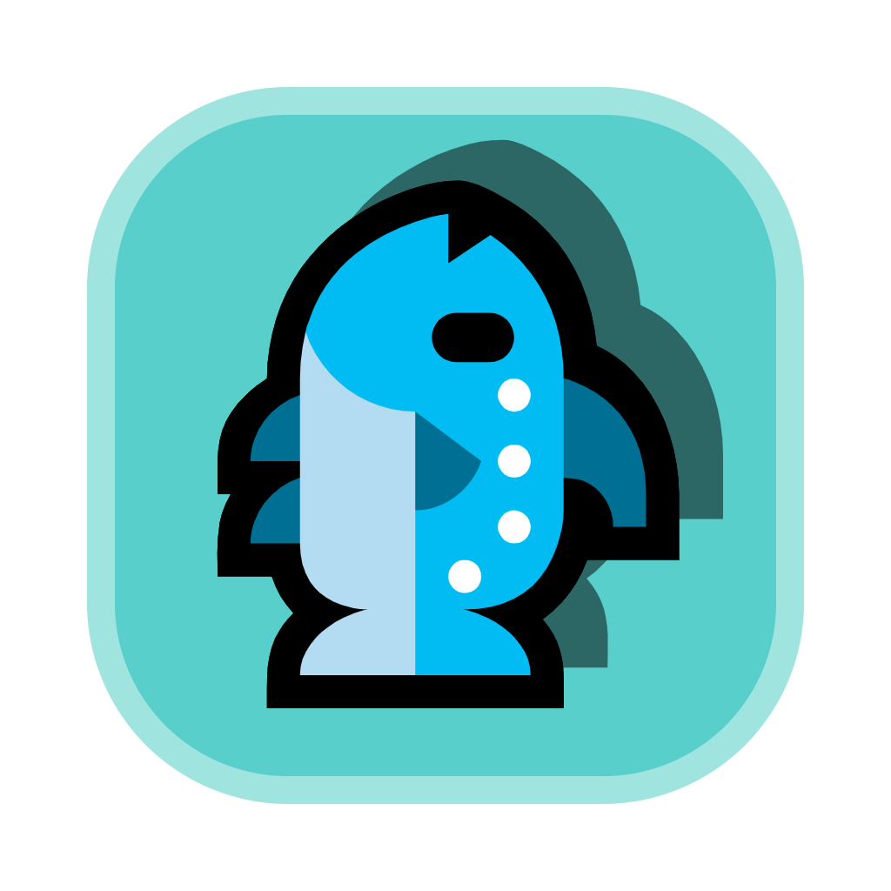

# Fish Time Tracker

<div align="center">
  
  <br>
  <p>Track your time, boost your productivity</p>
</div>

## 📝 Project Overview

Fish Time Tracker is a desktop application designed to automatically record the time spent on different applications. Through detailed statistics and intuitive visualization reports, it helps users understand their time allocation, thereby improving work efficiency and time management skills.

## ✨ Key Features

- **Real-time Monitoring**: Automatically detects and records the currently active application with precise timing
- **Process Whitelist Management**: Add applications that don't need monitoring to a whitelist for flexible control
- **Comprehensive Reports**: Generate detailed usage reports including application names, icons, and usage duration
- **Data Export Options**: Export usage data in XLSX, CSV, and PDF formats for archiving and analysis
- **Multi-language Interface**: Support for both Chinese and English interfaces to meet different user needs
- **Theme Customization**: Choose between dark, white, and gray themes for a personalized visual experience
- **Font Settings**: Customize interface fonts and colors for a comfortable user experience
- **System Tray Operation**: Can be minimized to the system tray to continue recording without occupying desktop space

## 🔧 Technology Stack

- **Programming Language**: Python
- **GUI Framework**: PyQt5
- **Data Storage**: SQLite
- **Data Visualization**: Matplotlib
- **Supporting Libraries**: psutil, openpyxl, fpdf, pywin32

## 📦 Installation and Setup

### 1. System Requirements

- Python 3.6 or higher
- Windows operating system

### 2. Get the Code

```bash
git clone https://github.com/yourusername/fishtime.git
cd fishtime
```

### 3. Install Dependencies

```bash
# Create and activate a virtual environment (optional)
python -m venv .venv
.venv\Scripts\activate

# Install required packages
pip install -r requirements.txt
```

### 4. Run the Application

```bash
python app.py
```

## 🚀 User Guide

1. **Launch the App**: After running the program, the application automatically starts recording the current active window
2. **View Current Tracking**: The main interface displays the name and icon of the currently active application
3. **Manage Whitelist**: Use the "Process Whitelist" feature to add or remove applications that shouldn't be monitored
   - Manually enter application names to add to the whitelist
   - Select from a list of previously tracked applications
4. **View Reports**: Click "Generate Report" to view application usage statistics for the day
5. **Export Data**: In the report interface, choose your preferred format (XLSX/CSV/PDF) to export data
6. **Clear Records**: If needed, click "Clear Records" to delete historical data
7. **Personalization Settings**:
   - Change interface language (Chinese/English)
   - Switch theme style (Dark/White/Gray)
   - Customize font style and color

## ⚙️ Configuration

Application settings are stored in the `config.json` file, which includes:

```json
{
    "font_family": "Microsoft YaHei",
    "font_color": "#2E3440",
    "language": "zh_CN",
    "theme": "灰色",
    "Process Whitelist": []
}
```

- **font_family**: Interface font
- **font_color**: Font color
- **language**: Language setting ("zh_CN" or "en_US")
- **theme**: Interface theme ("暗黑" (Dark), "白色" (White), or "灰色" (Gray))
- **Process Whitelist**: List of whitelisted processes

## 📷 Screenshots

 


## 📄 License

This project is licensed under the MIT License. See the [LICENSE](LICENSE) file for details.

## 🤝 Contributing

Suggestions and improvements to the project are welcome! For any issues or suggestions, please submit an issue or pull request.

---

<div align="center">
  <p>Made with ❤️ by Yijun Feng</p>
</div>
